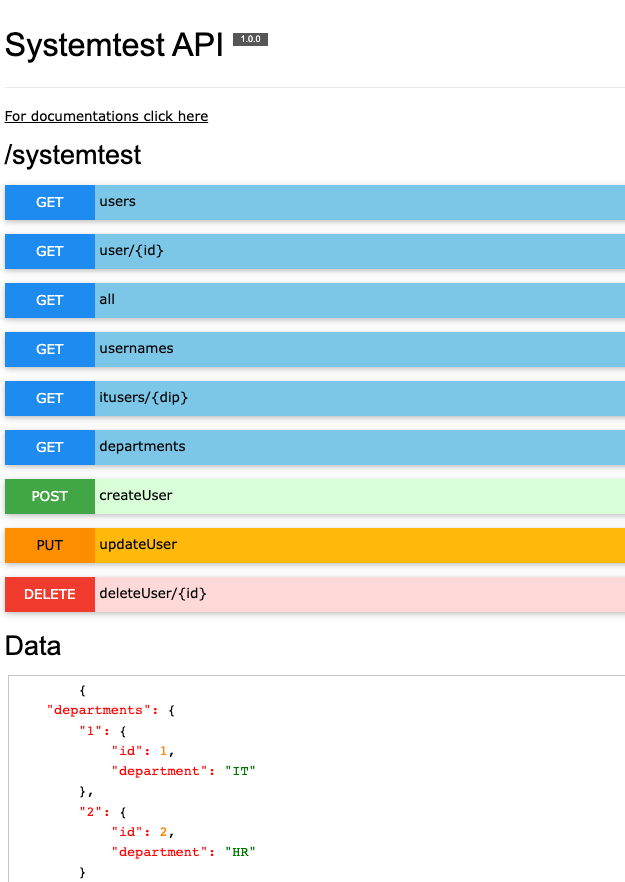

# Fake REST API

Creates a simple fake REST API from a single json file.


## Setup

-   Make sure you have a fakeAPI.json on your project's root folder
-   Add script `"fakeapi": "npx fakeapi"` to package.json
-   npm run fakeapi

Your service will be run on `http://localhost:3000`

## Display APIs

Base on your `fakeAPI.json` SETTINGS

http://localhost:{port}/{name}/{version}
if you pass SETTINGS.version as empty or remove it path will be

http://localhost:{port}/{name}



## Documentation

Modify fakeAPI.json

```json
{
    "GET": {
        "users": {
            "users": "users/{*}"
        },
        "user/{id}": {
            "user": "users/{id}[name]"
        },
        "all": {
            "users": "users/{*}",
            "departments": "departments/{*}"
        },
        "usernames": {
            "users": "users/{*}[name]"
        },
        "itusers/{dip}": {
            "users": "users/{dip}[name]: Object"
        },
        "departments": {
            "departments": "departments/{*}[department]: Array"
        }
    },
    "POST": {
        "createUser": {
            "result": { "message": "created" },
            "where": "users/{*}",
            "body": {
                "id": 1,
                "name": "name",
                "lastName": "lastName"
            }
        }
    },
    "PUT": {
        "updateUser": {
            "result": { "message": "updated" },
            "where": "users/{id}",
            "body": {
                "id": 1
            }
        }
    },
    "DELETE": {
        "deleteUser/{id}": {
            "result": { "message": "deleted" },
            "where": "users/{id}"
        }
    },
    "ERROR": {
        "404": {
            "code": "404",
            "messages": [
                {
                    "type": "Error",
                    "message": "Invalid Id"
                }
            ]
        },
        "500": {
            "code": "500",
            "messages": [
                {
                    "type": "Error",
                    "message": "Not exist"
                }
            ]
        }
    },
    "DATA": {
        "departments": {
            "1": { "id": 1, "department": "IT" },
            "2": { "id": 2, "department": "HR" }
        },
        "users": [
            { "id": 1, "name": "Salih", "lastName": "Onder", "dip": 1 },
            { "id": 2, "name": "Semih", "lastName": "Onder", "dip": 1 },
            { "id": 3, "name": "Sinan", "lastName": "Onder", "dip": 2 }
        ]
    },
    "SETTING": {
        "name": "systemtest",
        "version": "",
        "versionNumber": "1.0.0",
        "port": 3000
    }
}
```

### QUERY

Filters and convertors applies on GET only.

-   GET `users/{*}`: List all users from fakeAPI.json --> DATA
-   GET `users/{id}`: List user with given id from fakeAPI.json --> DATA
-   GET `users/{*}[name]` : List all users and displays name only
-   GET `users/{dip}[name]: Object` : List users with given dip - department id as Object
-   GET `departments/{*}[department]: Array`: List all departments with names as Array
-   POST `users`: Create a user on users using body on fakeAPI.json --> DATA
-   PUT `users/{id}`: Update user with given id using body on fakeAPI.json --> DATA
-   DELETE `users/{id}`: Delete user with given id from fakeAPI.json --> DATA

### GET VERB QUERY EXAMPLE RESULTS

```json
// departments/{*}[department]: Array
{
    "departments": [
        {
            "department": "IT"
        },
        {
            "department": "HR"
        }
    ]
}

// users/{dip}[name]: Object
{
    "users": {
        "1": {
            "name": "Salih"
        },
        "2": {
            "name": "Semih"
        }
    }
}
```

### OTHER RESPONSES

in order to make 404 etc responses, create a section under `ERROR` in fakeAPI.json as,

```json
"404": {
            "code": "404",
            "messages": [
                {
                    "type": "Error",
                    "message": "Invalid Id"
                }
            ]
      }
```

then request it like `/path/users/{*}:404`

## Author

-   Salih Onder | [salihonderx@gmail.com](mailto:salihonderx@gmail.com)

## License

[MIT](./LICENSE)
